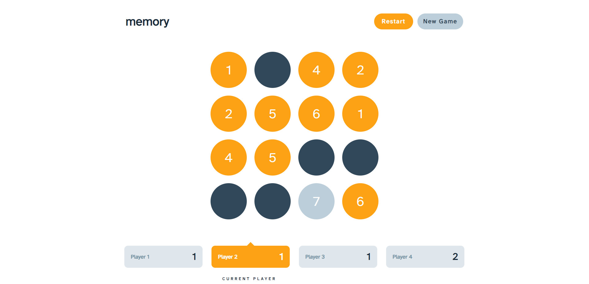

# Memory Multiplayer Game
In this game you can play up to 4 people. You all take turns to guess the correct position of two matching tokens. When teh game ends, the program will summary all the points and choose winner (or winners). You choose if you want to play alone or with friends. You can choose if you will be guessing numbers or icon!

## Technologies
    - React
    - Redux
    - Collect.js
    - React Router
    - SCSS
    - React Card Flip
    - Array Shuffle
    - Vite

## Game Configurator

## Game Board

## Game Summary

